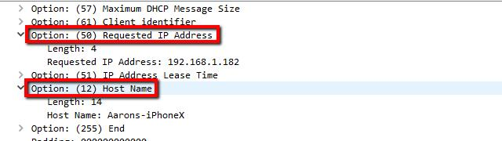

# Network Protocol Audit: DHCP, DNS & HTTP MITM Analysis

## Descripción del Proyecto
Proyecto de **Análisis de Redes y Ciberseguridad** centrado en la interceptación y disección de protocolos críticos en un entorno controlado.

El objetivo principal es auditar el flujo de comunicación cliente-servidor para entender la asignación dinámica de IPs (DHCP), la resolución de nombres (DNS) y demostrar la vulnerabilidad de las comunicaciones no cifradas (HTTP) mediante técnicas de sniffing.

---

## Características Principales
- **Análisis Multi-Protocolo**: Auditoría detallada de DHCP, DNS y HTTP.
- **Disección DORA**: Seguimiento paso a paso del proceso de descubrimiento y asignación de direcciones.
- **Intercepción MITM**: Demostración práctica de captura de credenciales en texto plano.
- **13 capturas** detalladas del tráfico real en Wireshark.
- Entorno **100% reproducible en local**.

---

## Tecnologías y Herramientas Utilizadas
- **Wireshark** (Packet Sniffing & Analysis)
- **Protocolos de Red**:
  - DHCP (UDP/67-68)
  - DNS (UDP/53)
  - HTTP (TCP/80)
- **Servidores de Prueba**:
  - Servidor Local Python (HTTP Server)
  - Google DNS (8.8.8.8)

---

## Objetivos Alcanzados
- Verificación completa del proceso DORA (Discover, Offer, Request, ACK).
- Resolución autoritativa de dominios externos (xtec.cat) y análisis de registros A/AAAA.
- Intercepción exitosa de un formulario de login vulnerable, capturando usuario y contraseña en texto plano.
- Propuesta de mitigación mediante la implementación de certificados SSL/TLS (HTTPS).

---

## Arquitectura del Proyecto
El proyecto se divide en tres fases de auditoría:
1. **Auditoría de Direccionamiento**: Captura del broadcast DHCP y la transacción ID única.
2. **Inspección DNS**: Análisis de la jerarquía de consultas y respuestas de red.
3. **Análisis de Vulnerabilidad Web**: Captura del payload en paquetes POST para demostrar la falta de cifrado en HTTP.

---

## Proceso de Configuración (Resumen)

### 1. Captura y Filtrado
- Configuración de interfaces en modo promiscuo.
- Aplicación de filtros específicos (\`dhcp\`, \`dns\`, \`http\`) para aislar el tráfico objetivo.

### 2. Análisis de Flujo (Follow Stream)
- Reconstrucción de la sesión TCP para visualizar los datos del formulario de login.

---

## Aplicaciones Prácticas
- Auditoría de seguridad en redes corporativas.
- Aprendizaje de protocolos de capa de aplicación y transporte.
- Concienciación sobre la importancia del cifrado punto a punto.

---

## Conclusión
El análisis demuestra que sin el uso de protocolos seguros (HTTPS), la información sensible es fácilmente interceptable en la red. Se confirma la robustez del proceso DHCP para la gestión de IPs y la eficiencia del sistema DNS, resaltando la necesidad crítica de cifrado en cualquier aplicación web moderna.

⭐ Si te interesa la ciberseguridad, ¡dale una estrella al repositorio!

---

## Capturas del Proceso Completo

---

**Autor**: Pau Olivé Moreno
**Fecha**: Marzo 2026
